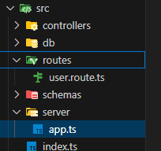

We place all our "routes" in separate file to keep our "index.ts" file neat and clean. For that we create separate "routes" folder inside our "src" directory adjacent to "index.ts" file. And inside that "routes" folder, we create "route.ts" file and handle our routes. That is possible only with the help of "Router" function from "express".
<br> The folder structure is shown below;



<br> We import "Router" in our "route.ts" file from "express" and instantiate an object as;

```
import { Router, Request, Response } from "express";

const router = Router();
```

Then we replace all our "app.get()" or "app.post()" etc. with "route.get()" and "route.post()"etc.

```
router.get("/users/:username", (req: Request, res: Response): void => {
    res.send(`<h1>The username is ${req.params.username}</h1>`);
});
```

After that we export our "router". It is better to export with other name rather than "router" because we may have multiple "route.ts" file in our project.

```
export const learnRouter = router;
```

Then we import the exported "router" in our "app.ts" file inside our "server" folder adjacent to "index.ts" file;

```
import { learnRouter } from "../routes/learn.route.ts";
```

After that we use "app.use()" method and pass the "router" we imported.

```
app.use("/", learnRouter);
```

The folder structure looks-like;


The whole sample code for "route.ts" looks like;

```
import { Router } from "express";

const router = Router();

router.get("/users/:username", (req: Request, res: Response): void => {
    res.send(`<h1>The username is ${req.params.username}</h1>`);
});

export const learnRouter = router;
```

The sample code for "app.ts" looks like;

```
import express from "express";
import { learnRouter } from "../routes/learn.route.ts";

export const app = express();

app.use("/", learnRouter);
```
