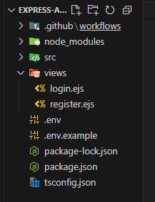

Install the template engine, you want to use;

```
npm i <engine_name>
```

Create the "views" folder at your root directory and inside that folder, you can create your templates.
<br> **Note:** The templates must end with the same extension name. (For eg: file_name.engine_name)

In your "app.ts" file inside the "server" folder, set your "view engine" to the engine you are using as;

```
app.set("view engine", "ejs");
```

Now use can render templates using "res.render()" method and passing the file name. There is no need to provide the absolute path/relative path. Just provide the path from "views" directory.
<br> The following sample code shows how to render the templates;

```
export const getregisterPage = (req: Request, res: Response) => {
    return res.render("register");
}
```

If you place your "views" folder parent directory is other than the root, then you must manually set the path also;

```
app.set("views", path.join(import.meta.dirname, "..", "..", "views"));
```

The below image shows the default position of "views" folder.


