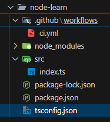

To create a node.js proeject using typeScript, first create a folder and move to the folder using the command;

```
cd ./folder-name
```

Then run npm init to initialize your project

```
npm init -y
```

Then install neceessary pacakges for typeScript and express using the following command;

```
npm install typescript @types/node tsx @types/express -D
npm i express
```

Here, "ts-node-dev" runs typeScript files without compiling it into javaScript during development mode. And "@types/node" package provides type definitions for built-in Node.js modules (like "fs", "path", "http").

Then initialize your typeScript compiler using the following command;

```
npx tsc --init
```

Now create a "src" folder inside the root directory and inside the "src" folder, create "index.ts" file.

Then configure your "package.json" file to run it in the development mode;

```
"scripts": {
  "dev": "tsx watch src/index.ts",
}
```

"watch" helps in hot-reloading.

To build your project, add this to the "package.json" file;

```
"scripts": {
  "build": "tsc"
}
```

For using typeScript with ES module, specify the following in your "tsconfig.json" file

```
"{
  compilerOptions": {
    "rootDir": "./src",
    "outDir": "./dist",
    "target": "ES2024",
    "noEmit": true,
    "allowImportingTsExtensions": true,
    "module": "ESNext",
    "moduleResolution": "bundler",
    "esModuleInterop": true,
    "forceConsistentCasingInFileNames": true,
    "moduleDetection": "force",
    "strict": true,
    "skipLibCheck": true,
  },
  "ts-node": {
    "esm": true
  }
}"
```

To start your built app, add this to the "package.json" file;

```
"scripts": {
  "start": "node dist/index.js"
}
```

If you want to use ES module syntax in your node.js project, then add the following script in your "package.json" file

```
"type": "module"
```

To type check your typeScript file, add it to the scripts in your "package.json" file

```
"scripts": {
    "type-check": "tsc --noEmit"
}
```

Then run type check using the following command;

```
npm run type-check
```

For checking linting of even better quality, install the following packages;

```
npm install eslint @typescript-eslint/parser @typescript-eslint/eslint-plugin -D
```

Then add the following scrits in your "package.json" file;

```
"scripts": {
    "lint": "eslint . --ext .ts"
}
```

To run eslint in all of your typeScript files, run the following command;

```
npm run lint
```

The overall scripts in your "package.json" would look like;

```
{
    "type": "module",
    "scripts": {
        "dev": "tsx watch src/index.ts",
        "build": "tsc",
        "start": "node dist/index.js",
        "type-check": "tsc --noEmit",
        "lint": "eslint . --ext .ts"
    }
}
```

When importing TypeScript files with ESM, you must include extension too:

```
import { someFn } from "./some-file.ts";
```

During development mode, run the app using the following command;

```
npm run dev
```

Build your app using the following command;

```
npm run build
```

Start your production ready app using the following command;

```
npm run start
```

To enforce type-checking in CI/CD pipeline, create a folder named ".github" inside which create another folder named "workflows" inside of which you can create your ".yml" file.
<br> Now add the following script in your ".yml" file;

```
name: CI

on:
  push:
    branches: [main] # Specify the branch where we want to trigger the workflow
  pull_request:
    branches: [main]

jobs:
  build:
    runs-on: ubuntu-latest

    steps:
      - uses: actions/checkout@v3

      - name: Install Node.js
        uses: actions/setup-node@v3
        with:
          node-version: 23 # Specify the node.js version, you are working with

      - name: Install Dependencies
        run: npm ci

      - name: Type Check
        run: npm run type-check

      - name: Build
        run: npm run build

      - name: Lint
        run: npm run lint
```

This ensures no code is deployed with type errors.

The folder structure looks like;


