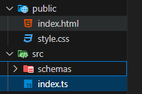

"express.static" middleware is used to serve static files in express.js. First, all the static files (like "html", "css" and "js/ts") must be placed inside our "public" folder and then only we can serve them using "app.use()" method.
<br> The sample code is written below;

```
const absoluteStaticPath = path.join(__dirname, "..", "public");

app.use(express.static(absoluteStaticPath));
```

It is better to pass absolute path inside "express.static()" middleware rather than passing relative path.

The folder structure of which is shown below;



We can also pass the route parameter in "app.use()" method to define in which route should the static file be served.

```
app.use("/contact", express.static(absoluteStaticPath));
```

By default, the static file is served in the homepage.
