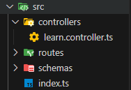

We place all our logic related to user-routes in separate file to keep our "route.ts" file neat and clean. For that we create separate "controllers" folder inside our "src" directory adjacent to "index.ts" file. And inside that "controllers" folder, we create "controller.ts" file and keep our logic.
<br> The folder-structure is shown below;



We export our logic function and import that in our "route.ts" file and use it instead of callback function.
<br> The sample code for "controller.ts" looks-like;

```
import { Request, Response } from "express";

export const homeController = (req: Request, res: Response): void => {
    res.send(`<h1>Hello world. I am Roshan. Would you like to add more. Well well. Working fine.Here too. Just still fixing. Finalized</h1>`);
};
```

And the sample code of "route.ts" file looks-like;

```
import { Router } from "express";
import { homeController } from "../controllers/learn.controller.ts";

const router = Router();

router.get("/", homeController);

export const learnRouter = router;
```
