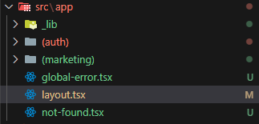

For handling fallback errors, so that it doesn't affect the whole app, we use "error.jsx/error.tsx" file. Inside that file, whatever we render will be displayed when error occurs. This doesn't affect other routes from running. We create "error.tsx/error.jsx" file in those routes folder where we expect error to occur and this file must be adjacent to the "page.tsx/page.jsx" file.
<br>The folder structure looks like;


Since, "error.tsx/error.jsx" must be a client component. We should include "use client" directive at the top as;

```
"use client";
```

<br> The sample code for "error.tsx/error.jsx" looks like;

```
export default function ErrorBoundary({
    error
}: {
    error: Error
}){
    return <>{error.message}</>;
}
```

Some errors are temporary and can be fixed with simple retry.
<br> Apart from "error", "ErrorBoundary" function inside "error.tsx/error.jsx" provides with another props i.e; "reset". This function is used to re-render the page to fix the simple error issue.

```
export default function ErrorBoundary({
    error,
    reset
}: {
    error: Error;
    reset: () => void;
}){
    //body of function
}
```

Since, "error.tsx/error.jsx" is a client component, on hitting the refresh via "reset" function, we will keep getting error again and again. This is because "reset" function will attempt to re-render client side. For server side recovery, we need to rely on "startTransition" function from "react" and "useRouter" hook from "next/navigation".
<br> Import "useRouter" and "startTransition" using the following command;

```
import { useRouter } from "next/navigation";
import { startTransition } from "react";
```

Define another function (say, "reload") inside the export default function as;

```
const router = useRouter();
const reload = () => {
    startTransition(() => {
        router.refresh();
        reset();
    })
}
```

This allow react to handle any pending state updates before proceeding, thus fixing this issue.

"error.tsx/error.jsx" handles error in all of its nested routes.

"error.tsx/error.jsx" can't handle for the error of "layout.tsx/layout.jsx" in the same segment. This is because in component hierarchy, "Layouts" lie above "Error Boundary". So, "error.tsx/error.jsx" must be placed in the parent route folder of "layout.tsx/layout.jsx"

So, this means there can't be any "error.tsx/error.jsx" file to handle the errors for the root layout. This is where "global-error.tsx/global-error.jsx" comes into play. This component not only handles the error of the root layout but also the error of the nested components/routes. "global-error.tsx/global-error.jsx" works only in production mode and requires html and body tags to be rendered.
<br> The folder structure for "global-error.tsx/global-error.jsx" looks like



**Note:** You can't throw an error in the root layout. If you want to throw an error than that should be done in any other components and be imported in root layout.
