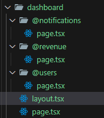
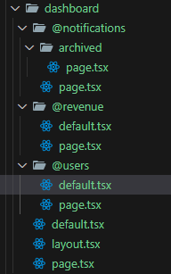

We can get same layout as component based structure with some extra benefits by implementing "parallel routes". Those benefits include independent route handling and sub-navigation. While in component based structure, error in one component affects the whole page, this is not the case with parallel routes. Here, error in one parallel routes affects only that section within the page by properly placing "error.tsx/error.jsx" file.
<br> Parallel routes can be defined by specifiying at the rate(@) before the folder name. The folder structure is shown below.



The defined parallel routes can simply be passed as an argument (like children).
<br> The sample code is shown below

```
export default function DashboardLayout({
    children, notifications, users, revenue
}: {
    children: React.ReactNode;
    notifications: React.ReactNode;
    users: React.ReactNode;
    revenue: React.ReactNode;
}){
    return <>
        <div className="flex justify-center items-center flex-col">
        <div>{children}</div>
        <div className="flex">
            <div className="flex flex-col">
                <div>{users}</div>
                <div>{revenue}</div>
            </div>
            <div  className="flex flex-grow">
                {notifications}
            </div>
        </div>
        </div>
    </>
}
```

We can navigate within the slots, by simply creating a nested route folder as we have previously did. However, if we try to reload the page after navigating to a particular slot, and if the other slots have unmatched routes, then we will get not-found error. To fix this error, we should create "default.tsx/default.jsx" file for each of the slots whose routes are unmatched (including children slot i.e; for "page.tsx/page.jsx"). This "default.tsx/default.jsx" will serve as a fallback view for the slots. In this file, you can render the content you want to display when fallback occurs.
<br> The folder structure now looks like;



Here, only "notifications" slot do not have any unmatched routes, so we didn't defined "default.tsx/default.jsx" for that slot.

For conditional rendering of parallel routes, we can't define what we want to render directly in our "layout.tsx/layout.jsx" file directly. We first need to create slot and return what we want to render in "page.tsx/page.jsx" file. Now, this slots can be used as props for conditional rendering.
