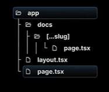

If you want to handle dynamic, variable-depth routes, use catch-all-segments. It allows you to access them as an array.
<br> For that you have to create a folder route after which you want to handle in-depth routes. Inside that folder create another folder just like you handled in dynamic routing but three dots before the name (Eg: [...slug]). And inside that folder create "page.tsx/page.jsx" file and write your code. You can use conditional statement to handle it since, slug is an array of string in this case.
<br> A demo example is shown below;

```
export default async function Docs({ params,
}: {
    params: Promise<{ slug: string[]; }>
}){
    const { slug } = await params;
    if(slug?.length === 1)   //"slug?" is checking whether slug exists or not. If it exists, then it checks it's length.
        return <h1>Viewing slug for feature {slug[0]}</h1>;
    else if(slug?.length === 2)
        return <h1>Viewing slug for feature {slug[0]} and concept {slug[1]} </h1>;
    return <h1>viewing slug</h1>
}
```

The folder structure is shown below.



Doing this, works for all the routes, except for the main folder route after which in-depth-variable route starts. To handle the main folder route, enclose the "...slug" folder name with the double square brackets (Eg: [[...slug]]). The rendering of default return is displayed here.
