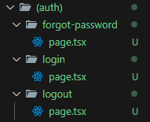

In next.js only, the "page.tsx/page.jsx" file inside the route folder is only rendered even though you can create other files inside that folder. They won't be rendered.

The other way of creating a separate folder is using underscore before the folder name (Eg: \_lib). The contents/files inside it won't be rendered.

You can group routes inside a folder by creating a folder whose name is enclosed in parethesis (Eg: (auth) ).
  The folder structure is shown below

If you have problem renaming the folder while the development server is running, then stop the server, rename it and then restart the server.
