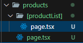
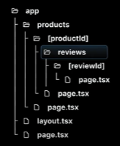

"params" is a promise that resolves into an object for dynamic route. So, whatever you write inside the square bracket"[]" of the folder is the params that it resolves.



A demo example is shown below.

```
export default async function ProductDetails({
    params,
}: {
    params: Promise<{ productId: string }>;
}){
    const productId = (await params).productId;
    return <h1>Details about product {productId}</h1>
}
```

URL params in Next.js (App Router) are always passed as strings.
<br> Nested dynamic routing can be implemented in the same way as nested routing and the folder structure is shown below;


