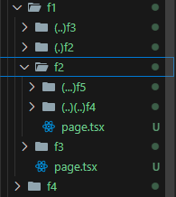

If we want to render a separate content/pattern (Eg: modal) when user navigate to that route and as soon as the user refreshes the page, we want to display another content/pattern (like the instagram handles for post on clicking), we use the concept of intercepting routes. The intercepting routes folder name begins with "(.)" followed by the name on which route we want to load another UI.
  For eg: the intercepting route folder name for "f2" folder would be "(.)f2". We can only navigate to the intercepted route via a "Link" from a sibling or one level above.
  The simple folder structure for intercepting routes looks like;

We use the following intercepting routes naming conventions;
  **(.)** to match segments on same level
  **(..)** to match segments one level above
  **(..)(..)** to match segments two level above (Just like ../../)
  **(...)** to match segments from root app directory
