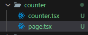

We can customize our metadata in each of the "layout.tsx/layout.jsx" file or "page.tsx/page.jsx" file as;

```
export const metadata = {
  title: 'Learning next.js',
  description: 'Generated by browser',
}
```

If you want specific metadata for particular route, then you can go to the "page.tsx/page.jsx" file inside the route and customize the metadata object just like the above.

If you want a dynamic metadata, then you have to use write "generateMetadata" function and return the object as metadata. This function returns "Promise<Metadata>" as an object.
<br> **Note:** The function name should be exactly "generateMetadata". You can't have "metadata" object and "generateMetadata" function inside the same file.
<br> The sample code is written below

```
export const generateMetadata = async ({
    params,
}: Props): Promise<Metadata> => {
    const id = (await params).productId;
    // Here for the title, new Promise is created since, we're waiting for the data to be fetched from the database which requires time. If we don't want to wait or don't want data to be fetched, then it is not necessary to create a new Promise
    const title = await new Promise((resolve) => {
        setTimeout(() => {
            resolve(`iPhone ${id}`);
        }, 100);
    })

    return {
        title: `Product ${title}`,
    };
}
```

Also, you must import "Metadata" from next, to create this function.

```
import { Metadata } from "next";
```

Type interfacing can be done in typeScript as;

```
type Props = {
    params: Promise<{ productId: string }>;
}
```

Remember you can't use "metadata" object or "generateMetadata" function in client-side routes directly.
<br> If you want to use it in client-side route, then create a separate component file inside that route folder and write the code which includes "react-hooks" and "use client" directive, then. Then import the component in your "page.tsx/page.jsx" file to be rendered.
<br> The sample code for the component looks-like.

```
"use client";

import { useState } from "react";

export const Counter = () => {
    const [ count, setCount ] = useState(0);

    return<>
        <h2>Count: {count}</h2>
        <button onClick={() => setCount( count+1 )}>Increase</button>
        <button onClick={() => setCount( count-1 )}>Decrease</button>
    </>
}
```

And the code for the "page.tsx/page.jsx" file is;

```
import { Counter } from "./counter";

export const metadata = {
    title: "Count",
};

export default function CounterPage() {
    return <Counter />;
}
```

The folder structure for client-side dynamic metadata handling looks like



If you need more control when defining an object, then you can use title Metadata. For that, we need to import "Metadata" from next and write the type of metadata object or "generateMetadata" function to "Metadata". Now, writing objects to "title" inside metadata will give you three powerful options, "default", "template" and "absolute". Default is applied for all those routes, where you don't have specific title metadata. Template is applied for those which have their own specific metadata but it is custom, means that %s is replaced by your particular route title name and other remains the same. And absolute is used if you want the exact title name you define in a particular route. The sample code is written below

```
import { Metadata } from "next"

export const metadata: Metadata = {
  title: {
    default: "Learn Next.js",
    template: `%s | Next.js`,
  },
  description: 'Generated by Next.js',
}
```

```
import { Metadata } from "next";

export const metadata: Metadata = {
    title: {
        absolute: "About"
    }
}
```
