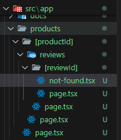

You can customize your not-found page by creating a separate "not-found.tsx/not-found.jsx" file inside your "app" folder and write your content in it.

"notFound" function can be imported to be displayed on other routes which display the content of your "not-found.tsx/not-found.jsx" file. It can be imported as;

```
import { notFound } from "next/navigation";
```

You can also create specific not-found function for various routes by creating a separate "not-found.jsx/not-found.tsx" file inside the folder and rendering separate content in it.

The folder structure looks like;



not-found function doesn't accepts any props. So, we have to use "usePathname" hook to get and use any input from the path. Import "usePathname" hook using the following command;

```
import { usePathname } from "next/navigation"
```

Create variable inside the function and acess the required fields from the path as an array and use it to render.

```
const pathname = usePathname();
const productId = pathname.split("/")[2];
const reviewId = pathname.split("/")[4];
```

Since all the next.js components are server components by default, we can't use hooks in server components directly. We can only use hooks in client components so, for that we need to convert the server component to client component using "use client" directive in the following way;

```
"use client";
```
