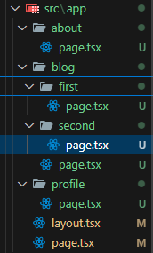

For creating routes, your folder must be inside "app" folder.
 The file name inside the folder must be "page.jsx/page.js" if it is javascript and "page.tsx/page.ts" if it is typescript.

For nested routing, within the folder created another folder and inside the folder, create "page.tsx/page.jsx" file.

