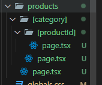

If you want some of the dynamic pages/routes to be pre-built as static page because it is frequently visited (Eg: Featured Products) and you want to increase the speed of your app, then we use the concept of "generateStaticParams".
<br> "generateStaticParams" is an async function that returns an array of objects, which takes the key value as dynamic route of which you want to generate the static content. During build time, it creates a static HTML file for the routes, which was assigned as value to the key. The sample code is written below;

```
export function generateStaticParams(){
    return [
        {productId: "book"},
        {productId: "copy"},
        {productId: "pen"},
    ]
}

export default async function ProductDetails({
    params,
}: {
    params: Promise<{ productId: string }>
}){
    const productId = (await params).productId;

    return <h1>Details about product {productId} at time {new Date().toLocaleTimeString()}</h1>
}
```

**Note:** "generateStaticParams" function must be used in the "page.tsx/page.jsx" file of the dynamic-route folder for which you are generating static content.

To handle routes with multiple dynamic segments, each object include values for both the dynamic segments needed to pre-render the routes.
<br> The sample code of which is shown below

```
export function generateStaticParams(){
    return [
        {productId: "book", category: "stationary"},
        {productId: "copy", category: "stationary"},
        {productId: "handkerchief", category: "clothing"},
    ]
}
```

Whose folder structure looks like;



Next.js provides us with the feature to handle dynamic pages which are not included in "generateStaticParams". We can handle them using "dynamicParams". If "dynamicParams" is set to "false", then on visiting those pages will show a 404 error and setting it to "true" will render the page. dynamicParams = true is the default behaviour of "generateStaticParams".
<br> We can define the "dynamicParams" using the following command;

```
export const dynamicParams = true;
```

"dynamicParams" must be defined in the same "page.tsx/page.jsx" file where "generateStaticParams" is defined.
