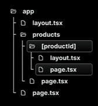

We can add certain components to all our routes by simply adding it in the layout. Those components should be inside the "body" tag. And the "children" of the layout is the "page.tsx/page.jsx" file of the same folder.

Similarly, we can add components for particular route (i.e; nested layout) by simply creating a "layout.jsx/layout.tsx" file inside the "route" folder where we exactly want.
<br> The sample code is given below

```
export default function ProductDetailsLayout({
    children,
}: {
    children: React.ReactNode
}){
    return <>
        {children}
        <div className="featured" style={{
            height: "40px",
            backgroundColor: "#e1b382",
            color: "#fff",
            textAlign: "center"
        }}>
            <h2>Featured Products</h2>
        </div>
    </>
}
```

The folder structure for nested layouts looks like as shown below;


