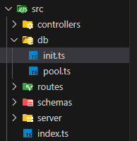

To connect postgres database with express, we first install "pg". Since, we are using typescript so, to define the types of "postgres" methods and classes, we also install "@types/pg" as dev-dependency using the following command.

```
npm i @types/pg --save-dev
npm  i pg
```

After that, we import "Pool" class from "pg" in our "pool.ts" file inside our "db" folder which is adjacent to "index.ts" file.

```
import  { Pool } from "pg";
```

Then we instantiate an object by calling "Pool" and passing an object to it. We also export the object we just instantiated.

```
export const pool = new Pool({
    host: "localhost",
    password: "pw@1234",
    user: "postgres",
    port: 5432,
    database: "expressdb",
    max: 50,
    connectionTimeoutMillis: 10000,
    idleTimeoutMillis: 30000,
})
```

Here, "max" key means maximum number of clients (connections) the pool can have at once.
<br> "connectionTimeoutMillis" means how long (in milliseconds) a client will wait for a connection to become available in the pool before timing out with an error
<br> "idleTimeoutMillis" means how long (in milliseconds) a connection should remain idle (unused) before being closed and removed from the pool.
<br> If we assign 0 to both "connectionTimeoutMillis" and "idleTimeoutMillis", then that means we are disabling the timeout.

Then we import "pool" object in our "init.ts" file inside "db" folder as;

```
import { pool } from "./pool.ts";
```

Then we pass query to the "pool" object we created to initialize our databse and export it to "index.ts" file. Since, we are fetching the data, so we must use "await".
<br> Any query can be written as;

```
export const initDatabase = async () => {
    try {
        await pool.query("SELECT 1");
        console.log("Connected to the database");

        app.listen(PORT, () => {
            console.log(`Server listening on PORT: ${PORT}`);
        });
    } catch (err) {
        console.error("Failed to connect to the database:", err);
        process.exit(1);
    }
};
```

Here, we must pass some query in "pool.query()". It can't be empty. "SELECT 1" means to do nothing. It's just for testing the connection.

The sample folder structure looks-like;



The sample code for "pool.ts" looks-like;

```
import { Pool } from "pg";

export const pool = new Pool({
    host: "localhost",
    password: "pw@1234",
    user: "postgres",
    port: 5432,
    database: "expressdb",
    max: 50,
    connectionTimeoutMillis: 10000,
    idleTimeoutMillis: 30000,
});
```

The sample code for "init.ts" looks-like;

```
import { pool } from "./pool.ts";
import { PORT } from "../schemas/env.schema.ts";
import { app } from "../server/app.ts";

export const initDatabase = async () => {
    try {
        await pool.query("SELECT 1");
        console.log("Connected to the database");

        app.listen(PORT, () => {
            console.log(`Server listening on PORT: ${PORT}`);
        });
    } catch (err) {
        console.error("Failed to connect to the database:", err);
        process.exit(1);
    }
};
```

The sample code for "index.ts" looks-like;

```
import { Request, Response } from "express";
import { initDatabase } from "./db/init.ts";
import { app } from "./server/app.ts";

app.use((req: Request, res: Response) => {
    res.status(404).send("Page not found");
});

initDatabase();
```
