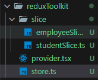

Inside "store.ts/store.js", we import "configureStore" and "combineReducers" from "@reduxjs/toolkit" using the following command;

```
import { configureStore, combineReducers } from "@reduxjs/toolkit";
```

Then we write all our reducers inside "combineReducers" helper function and assign it to a variable as;

```
const rootReducer = combineReducers({
  global: globalReducer,                      // for slices
  [api.reducerPath]: api.reducer,             // for services
});
```

After that we assign that variable to the "reducer" key inside "configureStore()". The "configureStore()" is then returned by wrapping it in a function which is then exported.
<br> The sample code is written below;

```
export const makeStore = () => {
  return configureStore({
    reducer: rootReducer,
  });
};
```

The folder structure of which is shown below.



If we are using typeScript, we also need to export the type of the store, reducer and dispatch in the following manner;

```
export type AppStore = ReturnType<typeof makeStore>;
export type RootState = ReturnType<AppStore["getState"]>;
export type AppDispatch = AppStore["dispatch"];
export const useAppDispatch = () => useDispatch<AppDispatch>();
export const useAppSelector: TypedUseSelectorHook<RootState> = useSelector;
```

Since, we were exporting the type of "useDispatch()" and "useSelector" hook, we also need to import those hooks along with "TypedUseSelectorHook" to wrap "RootState" once globally;

```
import { TypedUseSelectorHook, useDispatch, useSelector } from "react-redux";
```

The minimal setup for "store.ts/store.js" file is written below.

```
import { configureStore, combineReducers } from "@reduxjs/toolkit";
import { TypedUseSelectorHook, useDispatch, useSelector } from "react-redux";

const rootReducer = combineReducers({
  global: globalReducer,                     
  [api.reducerPath]: api.reducer,             
});

export const makeStore = () => {
  return configureStore({
    reducer: rootReducer,
  });
};

export type AppStore = ReturnType<typeof makeStore>;
export type RootState = ReturnType<AppStore["getState"]>;
export type AppDispatch = AppStore["dispatch"];
export const useAppDispatch = () => useDispatch<AppDispatch>();
export const useAppSelector: TypedUseSelectorHook<RootState> = useSelector;
```
