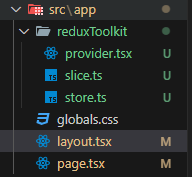

To, setup redux toolkit in next.js, we first create a folder inside our app directory (let's name it "reduxToolkit"), then we create 3 files, "provider.tsx/provider.jsx", "store.ts/store.js" and "slice.ts/slice.js".

We import the "Providers" Component exported from "provider.tsx/provider.js" file inside our root "layout.tsx/layout.jsx" using and then wrap the "children" props with that imported component.
<br> The code inside "layout.tsx/layout.jsx" file looks like;

```
import { Providers } from "./reduxToolkit/provider";

export default function RootLayout({
  children,
}: Readonly<{
  children: React.ReactNode;
}>) {
  return (
    <html lang="en">
      <body>
        <Providers>
          {children}
        </Providers>
      </body>
    </html>
  );
}
```

The folder structure looks like;


